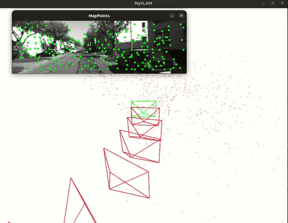

## SLAM VO Stereo Course
双目里程计，代码尚有诸多不完善地方，仅测试 KITTI 双目数据集。

## 修改
在《SLAM十四讲》第十三讲的代码基础上添加了基于深度学习的方法
1. 特征提取添加了 SuperPoint 方法
2. 基于光流法的特征匹配改为基于描述子的特征匹配

## 编译
程序环境参考《SLAM十四讲》第十三讲和[LightGlue-OnnxRunner-cpp](https://github.com/Nothand0212/LightGlue-OnnxRunner-cpp?tab=readme-ov-file)
```shell
# 配置阶段 
cmake -B build -DCMAKE_BUILD_TYPE=Release
## -D 选项 cmake -B build -DCMAKE_BUILD_TYPE=Release 
## -G 选项 cmake -B build -DCMAKE_BUILD_TYPE=Release -G Ninja
# 构建阶段 
cmake --build build -j4
## --target 选项 cmake --build build -j4 --target install
```
## 运行
1. 下载深度学习模型 **superpoint.onnx**, **superpoint_lightglue_fused_fp16.onnx**, 或者**superpoint_lightglue_fused.onnx**。
2. 测试 LightGlue end2end 需下载**superpoint_lightglue_end2end_fused.onnx**。
3. 根据电脑环境修改 **config/kitti.yaml** 文件。
4. 运行 GFTT 方式，将 **config/kitti.yaml** 里的 [track_method: SUPERPOINT]  修改为 [track_method: GFTT]。
```shell
./bin/test_kitti
```
5. 测试 LightGlue end2end 模型。
```shell
# export LD_LIBRARY_PATH=${your path}/onnxruntime/onnxruntime-linux-x64-gpu-cuda12-1.17.3/lib:$LD_LIBRARY_PATH
./bin/test_lightglue_end
```
6. 运行 SuperPoint 和LightGlue 方式，将 **config/kitti.yaml** 里的 [track_method: GFTT]  修改为 [track_method: SUPERPOINT]。
```shell
# export LD_LIBRARY_PATH=${your path}/onnxruntime/onnxruntime-linux-x64-gpu-cuda12-1.17.3/lib:$LD_LIBRARY_PATH
./bin/test_kitti
```

## 运行信息


硬件：
- CPU 7950X
- GPU 4090
- Mem 32GB
```txt
Odometry.cpp:62 VO cost time: 0.019 seconds.
Backend.cpp:180 Outlier/Inlier in optimization: 0 / 1582
SuperPointOrt.cpp:301 SuperPoint cost time(ms): 2.122616
LightGlueOrt.cpp:167 LightGlue cost time(ms): 2.974129
FeatsSuperPoint.h:162 Find 121 good pts in the current image.
Frontend.cpp:60 TrackLastFrame num track last 121
Frontend.cpp:64 tracking_inliers 58
Map.cpp:59 remove keyframe id 2892
Map.cpp:90 Removed 78 active landmarks
Frontend.cpp:95 Set frame 4660 as keyframe 2899
SuperPointOrt.cpp:301 SuperPoint cost time(ms): 3.328380
SuperPointOrt.cpp:301 SuperPoint cost time(ms): 2.010687
LightGlueOrt.cpp:167 LightGlue cost time(ms): 3.523982
FeatsSuperPoint.h:115 Find 154 good pts in the right image.
Frontend.cpp:165 new landmarks: 83
Backend.cpp:180 Outlier/Inlier in optimization: 0 / 1577
Odometry.cpp:62 VO cost time: 0.045 seconds.
```